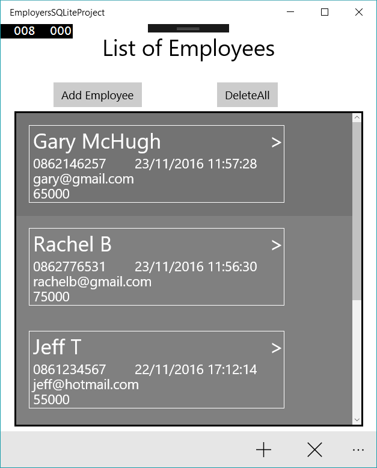
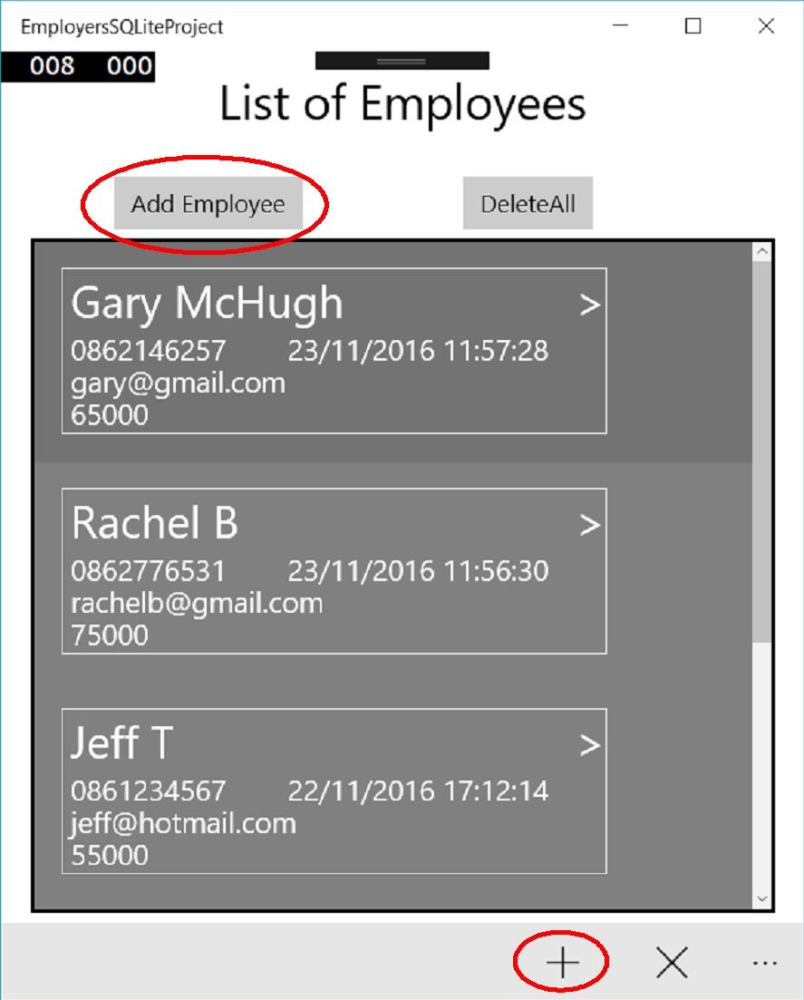
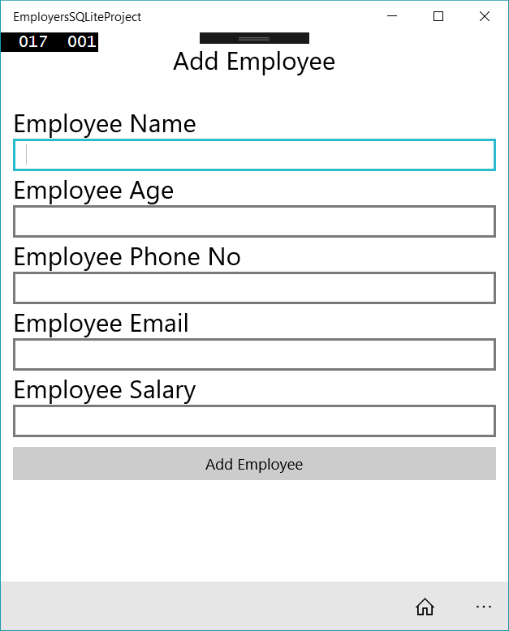
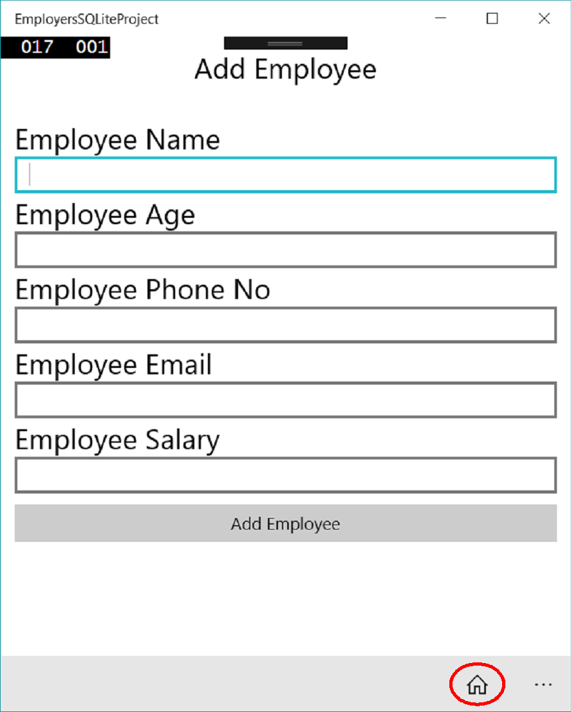
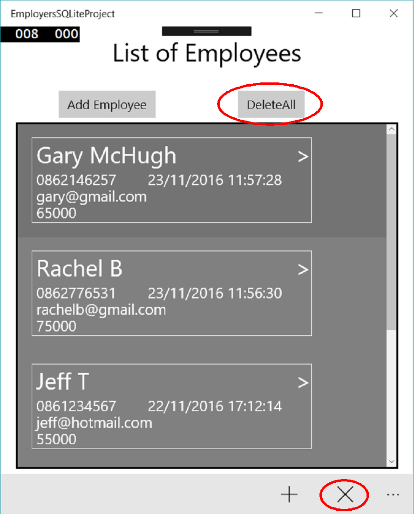
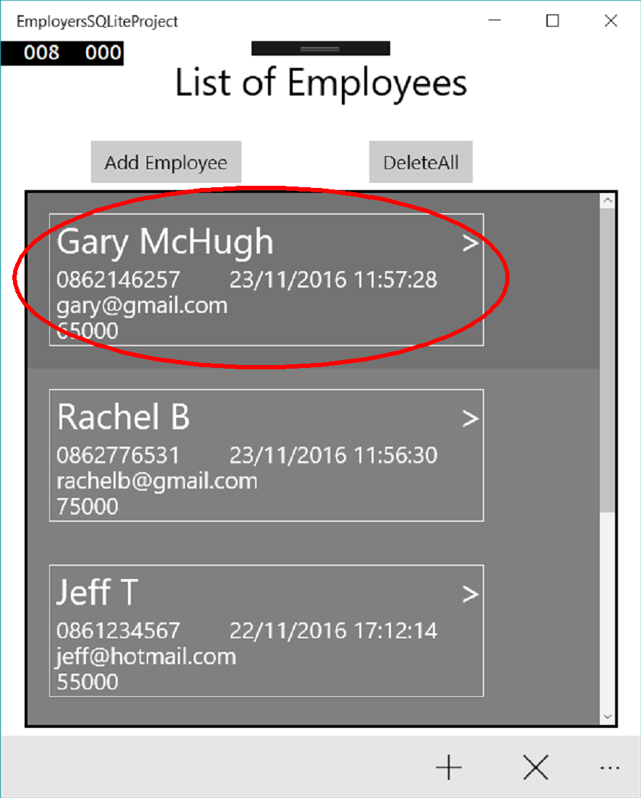
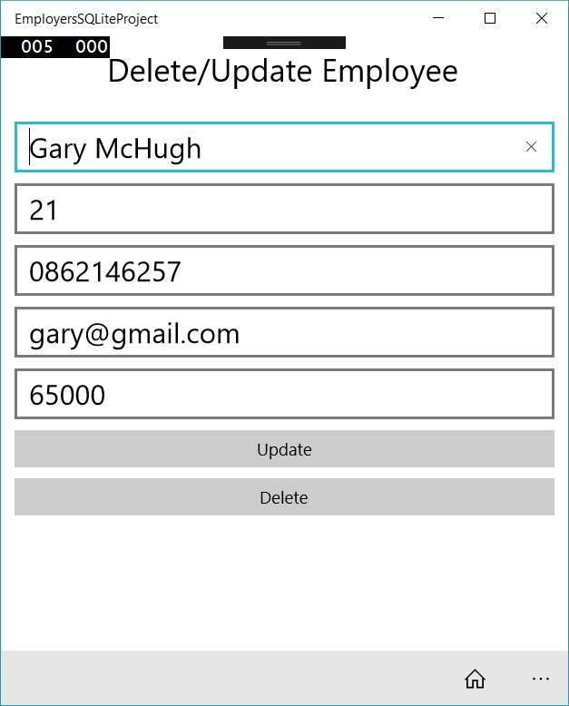

# Mobile Applications Project
###### Gary Mc Hugh, G00308668

## Introduction
I have created a Universal Windows Platform (UWP) application using SQLite for this project. The application is designed to be used by an employer to keep track of their employee’s names, 
contact details and salaries. An easy to use interface allows the user to easily navigate through the application and Add, Update and Delete Employees as they wish.
I have used the MVVM structure in this project to separate out my classes. The use of a command bar allows for easy navigation to and from the home page. 
This project uses various things I learned from the labs such as MVVM, SQLite, Observable Collections and Lambda expressions. 
The files 'SQLite.cs' and 'SQLiteAsync.cs' are publicly available files that I used to create this project. I found them at the following link:  
[SQLite Files](https://github.com/praeclarum/sqlite-net)

##How to use the Application
The following page will be displayed when the user starts the application:

From here the user can:
+ Select an Employee to Delete or Update
+ Add an Employee
+ Delete All Employees

To Add an Employee the user can Click the "Add Employee" Button or click the "+" on the command bar as shown:

This will bring the user to the add employee view shown below,
Where they can fill out the employee's details and add them to the database using the button.

The user can also navigate back to the home page from any page using the home icon displayed in the command bar:

The user can delete all employee's from the database using the "Delete All" Button or the "X" button in the command bar as shown:

Finally, the user can select an employee as shown below, this will bring them to the delete or update view.

The user can then update the employee's details in the text box's and click the "Update" Button or delete that employee by clicking the "Delete" Button as shown:

## Database
I designed the database to contain anything that an employer may want to store about their employee’s, such as name, age and contact details.
I used a primary key of employeeId as there is a chance that two people in the company may have the same name meaning that name could not be the primary key. 
EmployeeId is only used by the program as the user does not need to know about it.

The variables in the database are as follows:
+ Employee ID (primary key)
+ Employee Name
+ Employee Age
+ Employee Phone Number
+ Employee Email
+ Employee Salary

The value of these variables (except the primary key) can be updated at any time using the application.

